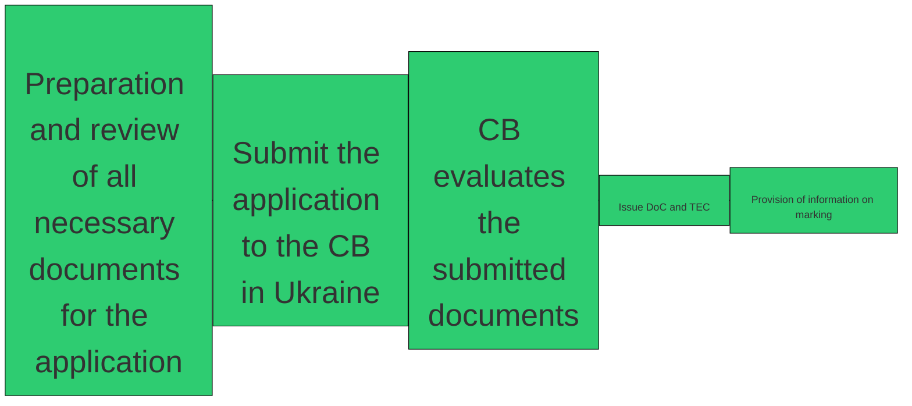

<h1> 

United States of America (USA) </h1>

# Product Regulatory for USA
{:.no_toc}
 

  

    
  

  
2nd Product

```mermaid
%%{init: { 'flowchart': { 'nodeSpacing': 1, 'rankSpacing': 1 } }}%%

graph LR
    A[<font size=20><br>Preparation and review of all necessary documents for the application] --> B[<font size=20><br>Submit the application to the CB in Ukraine]
    B --> C[<font size=20><br>CB evaluates the submitted documents]
    C --> D[<br>Issue DoC and TEC]
    D --> E[<br>Provision of information on marking]

    style A fill:#2ECC71,stroke:#000000
    style B fill:#2ECC71,stroke:#000000
    style C fill:#2ECC71,stroke:#000000
    style D fill:#2ECC71,stroke:#000000
    style E fill:#2ECC71,stroke:#000000   
```